# Eduverse - Smart Campus Management System

**Eduverse** is a robust, web-based educational platform designed to bridge the gap between school administration, teachers, students, and parents. Unlike traditional systems, it creates a holistic Learning Management System (LMS) environment to transform institutions into "Smart Campuses".

## Project Gallery

### Home & Authentication
| **Landing Page** | **Login Portal** |
|:---:|:---:|
| 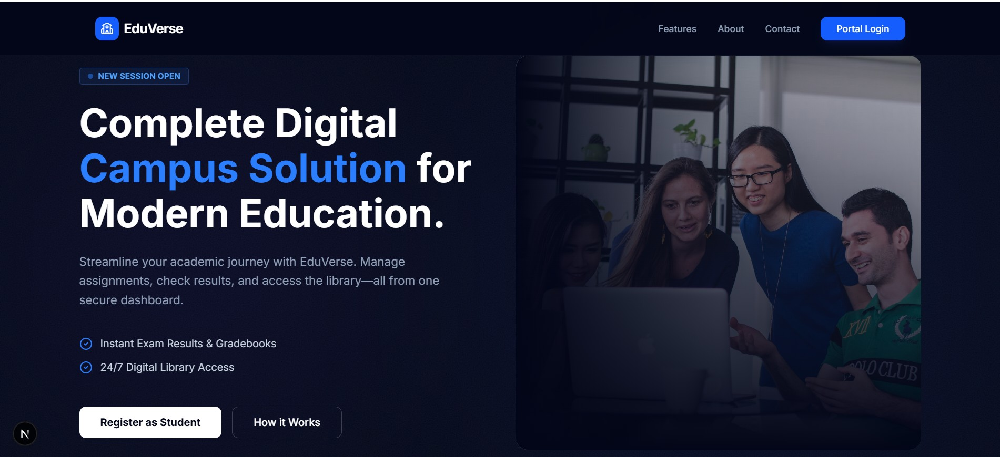 | 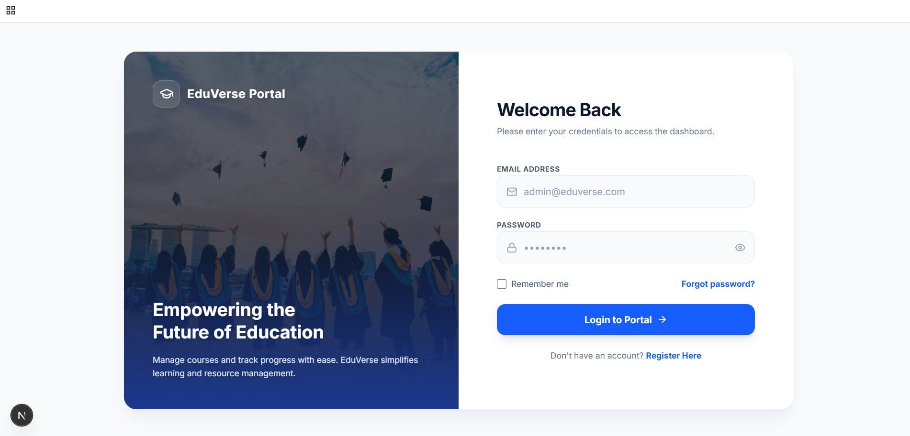 |
| **Registration** | |
| 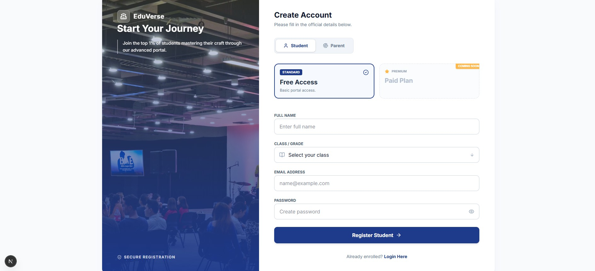 | |

### Admin Dashboard
| **Overview** | **User Management** |
|:---:|:---:|
| 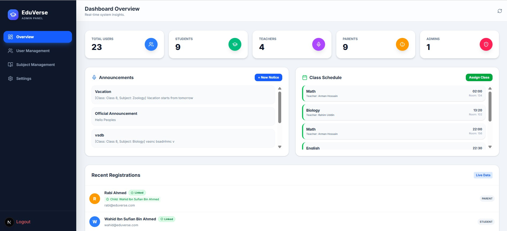 | 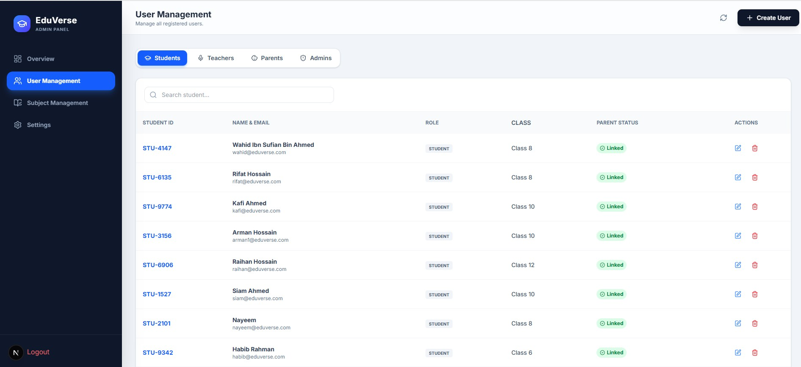 |
| **Class Assign** | **Subject Management** |
| 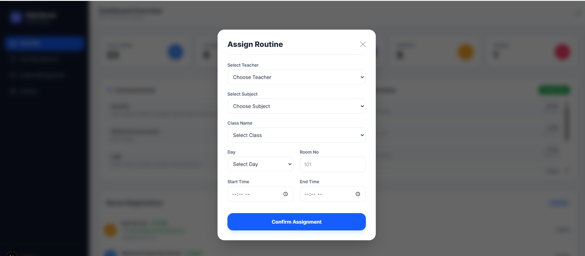 | 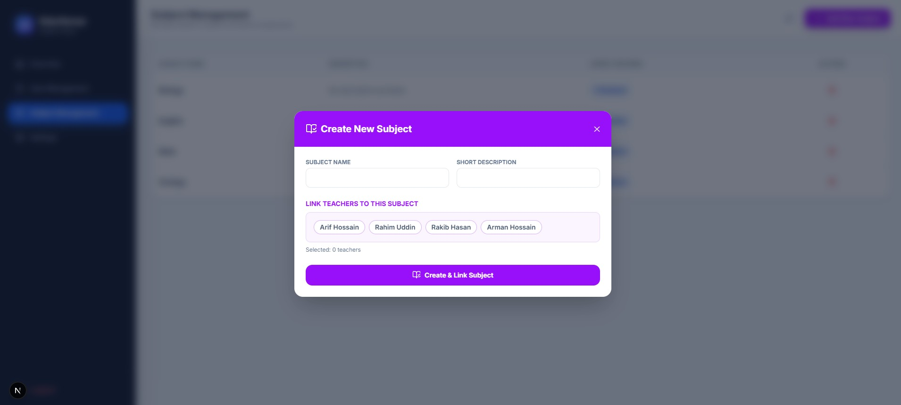 |

### Teacher Portal
| **Teacher Dashboard** | **Mark Entry** |
|:---:|:---:|
| 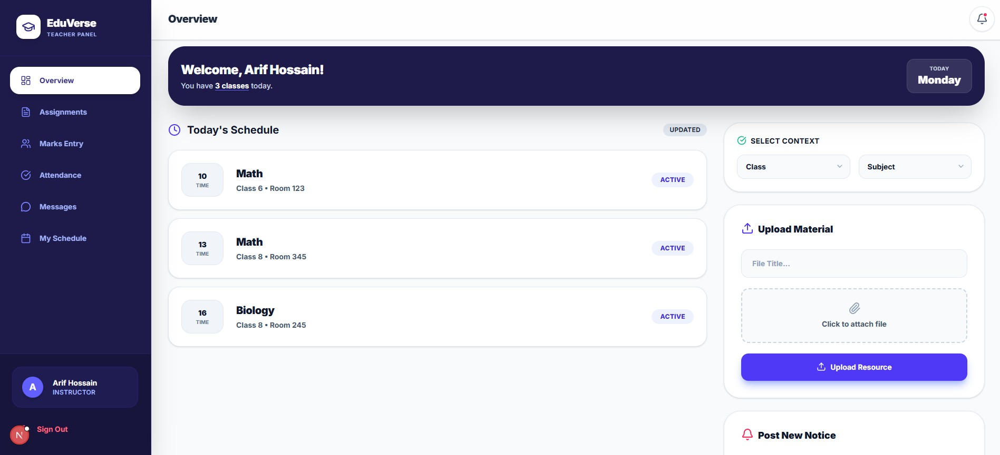 | 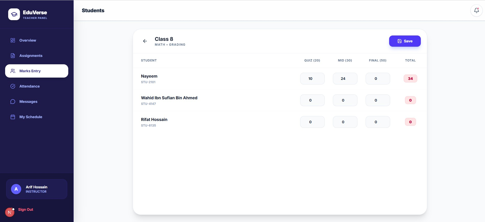 |
| **Create Assignment** | **Chat with Parents** |
| 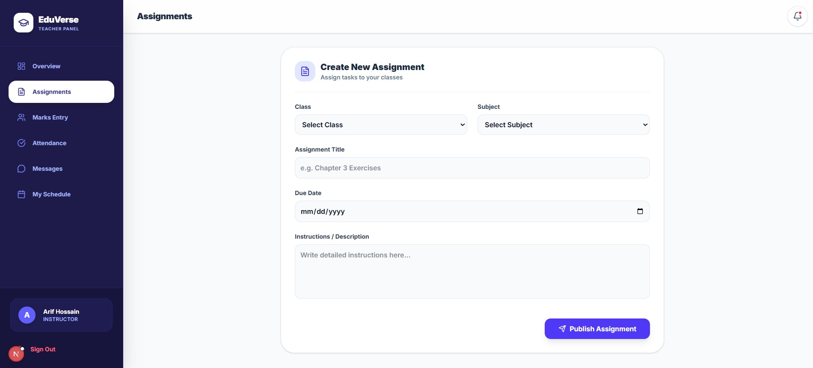 | 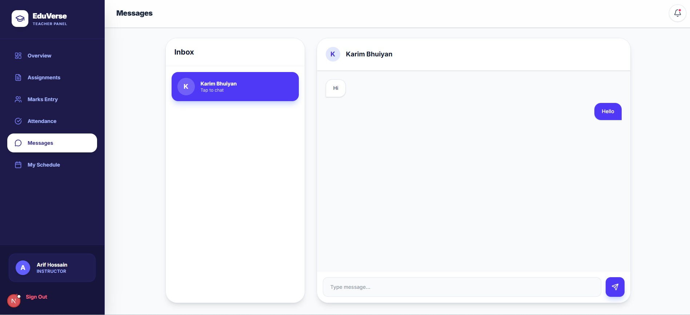 |

### 🎓 Student Portal
| **Student Dashboard** | **Class Routine** |
|:---:|:---:|
| 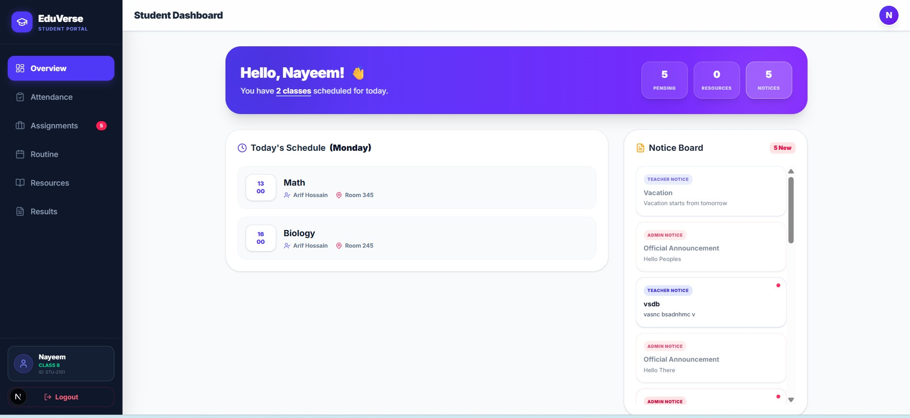 | 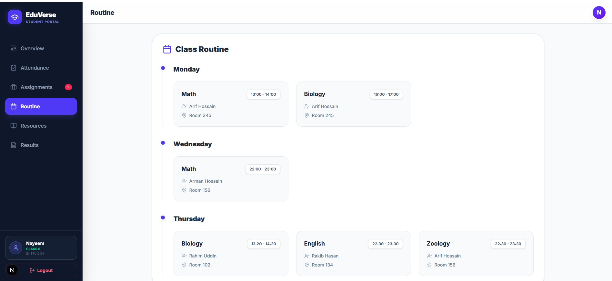 |
| **Resources** | **Exam Results** |
| 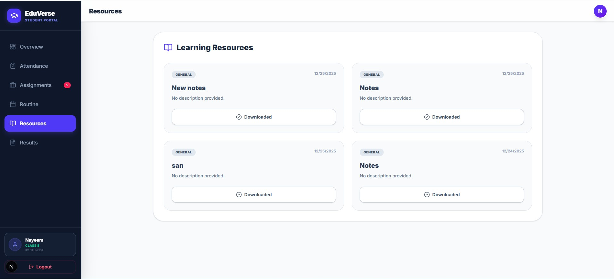 | 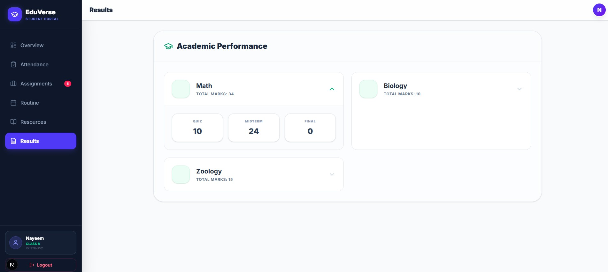 |

### Parent Portal
| **Parent Dashboard** | **Teacher Communication** |
|:---:|:---:|
| 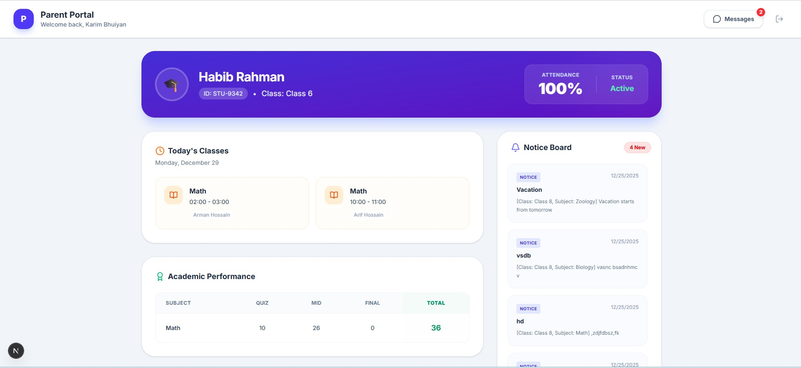 | 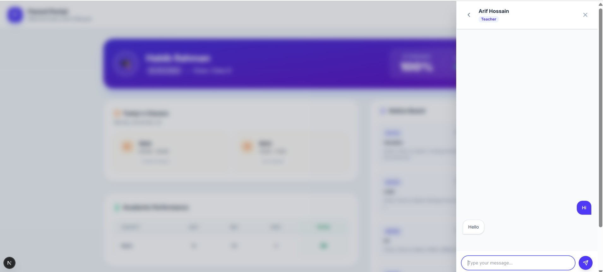 |

## Technology Stack
This project uses the **T3 Stack** architecture for type safety and performance.

* **Frontend:** Next.js (React) with Server-Side Rendering (SSR).
* **Language:** TypeScript for robust type safety.
* **Database:** MongoDB (Relational Model implementation).
* **ORM:** Prisma for intuitive database interactions.
* **Styling:** Tailwind CSS for responsive UI design.
* **Authentication:** NextAuth.js for secure role-based access control.

## Key Features

### 1. 🎓 Student & Parent Portal
* **Smart Registration:** Self-service signup where parents can link their profiles to students using a unique Student ID.
* **Personalized Routine:** Students see their specific daily class schedule (Subject, Time, Room) upon logging in.
* **Resource Access:** Download study materials (PDFs, Notes) uploaded by teachers.
* **Academic Tracking:** Parents can view attendance history and exam results in real-time.

### 2. Teacher Dashboard
* **Digital Classroom:** Upload resources, create assignments, and track deadlines.
* **Direct Communication:** Secure chat feature to communicate directly with parents regarding student progress.
* **Grading System:** Mark daily attendance and upload quiz/exam marks.

### 3. Admin Control
* **User Management:** Exclusive rights to create accounts for Teachers to ensure security.
* **Routine Management:** Create master schedules that are automatically pushed to student/teacher dashboards.

## Installation & Setup

1.  **Clone the repository:**
    ```bash
    git clone [https://github.com/ArmansHub/eduverse-lms.git](https://github.com/ArmansHub/eduverse-lms.git)
    cd eduverse-lms
    ```

2.  **Install dependencies:**
    ```bash
    npm install
    ```

3.  **Set up Environment Variables:**
    Create a `.env` file in the root directory and add your MongoDB URI and NextAuth secret.

4.  **Run the application:**
    ```bash
    npm run dev
    ```

## 👨‍💻 Developer

| Name | ID | Role |
| :--- | :--- | :--- |
| **Md Arman Hossain** | 2022-2-60-043 | Lead Developer |

---
*Developed for Software Engineering (CSE-412), East West University, Fall-2025.*
